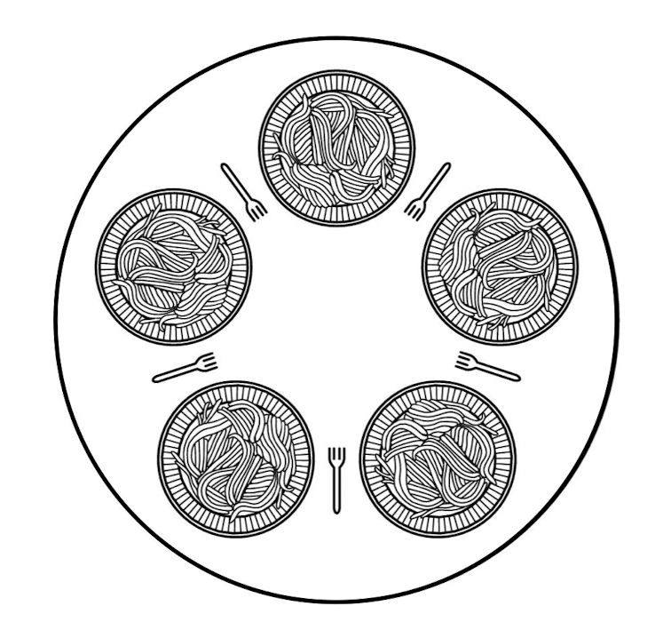

# 교착 상태 필요조건

> 교착 상태는 네 가지 조건을 **모두 동시에** 만족해야만 때만 발생

## 교착 상태의 4가지 필요조건

| 조건 | 내용 |
|---|---|
| 상호 배제 | 한 자원을 한 번에 하나의 프로세스만 사용할 수 있음  |
| 비선점 | 다른 프로세스의 자원을 강제로 빼앗을 수 없음 |
| 점유와 대기 | 자원을 쥔 채로 다른 자원을 추가로 기다림 |
| 원형 대기 | 프로세스들이 사이클 형태로 서로의 자원을 기다림 |

- 네 가지 조건 중 하나라도 성립하지 않으면 교착 상태는 발생하지 않는다
- 상호 배제와 비선점 조건은 자원의 특징을 나타낸다
- 점유와 대기, 원형 대기 조건은 프로세스가 어떠 행위를 하고 있는지를 나타낸다 

---

## 식사하는 철학자 문제

> 교착 상태의 필요조건을 보여주는 예시

{ width=600 }

- 원형 식탁에 철학자 5명이 앉아 있고, 각자 사이에 포크가 1개씩 총 5개
- 식사하려면 **양쪽 포크 2개**를 모두 들어야 함
- 모든 철학자가 동시에 **왼쪽 포크를 든 뒤 오른쪽 포크을 기다리면** → 전원이 멈춤 

**네 조건과의 대응**

| 필요조건 | 철학자 문제에서 |
|---|---|
| 상호 배제 | 포크는 한 번에 한 명만 쥘 수 있음 |
| 비선점 | 남의 포크를 뺏을 수 없음 |
| 점유와 대기 | 왼쪽 포크를 쥔 채 오른쪽 포크를 기다림 |
| 원형 대기 | 모두가 오른쪽 사람의 포크를 기다려 원형을 이룸 |

---

## 🔑 최종 정리

> 한 줄 요약: 교착 상태는 상호 배제·비선점·점유와 대기·원형 대기 네 조건이 모두 성립할 때만 발생하며, 이 중 하나만 깨뜨리면 교착을 예방할 수 있다
