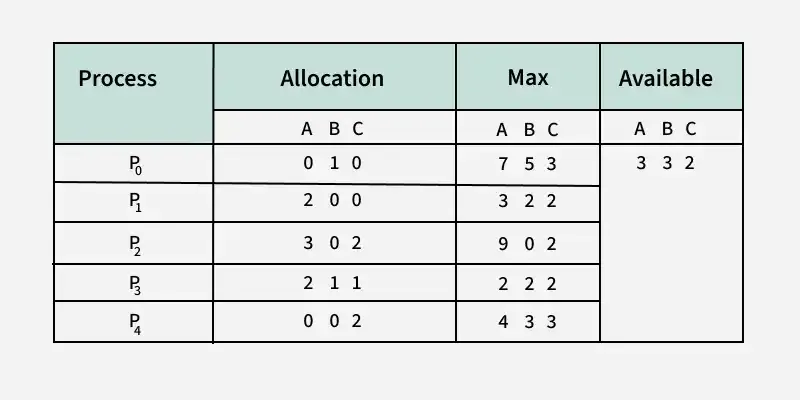

# 교착 상태 해결 방법

## 교착 상태 해결 방법

| 방법 | 핵심 |
|---|---|
| 예방  | 네 필요조건 중 하나를 원천적으로 막음 |
| 회피  | 자원을 줘도 안전한지 미리 따져보고 배정 |
| 검출  | 교착이 생기게 두고, 주기적으로 탐지 |
| 회복  | 검출된 교착을 풀어냄 |

- 예방·회피는 미리 막는 방식, 검출·회복은 생긴 뒤 처리하는 방식

---

## 교착 상태 예방

> 네 가지 필요조건 중 하나를 성립하지 못하게 만들어 교착 상태를 처리

| 깨는 조건 | 방법 | 부작용 |
|---|---|---|
| 상호 배제 | 자원을 공유 가능하게 만듦 | 공유 불가능한 자원 존재 |
| 비선점 | 자원을 빼앗을 수 있게 함 | 중간에 빼앗을 수 없는 자원 존재, 아사 발생 가능 |
| 점유와 대기 | 자원을 전부 할당하거나 아예 할당하니 않음 | 자원 활용률 저하, 아사 발생 가능 |
| 원형 대기 | 자원에 번호를 매겨 오름차순으로만 요청 | 자원 사용 순서가 강제돼 비효율 |

- 자원 활용률을 떨어뜨려 현실에서는 잘 쓰이지 않음

---

## 교착 상태 회피

> 교착 상태가 발생하지 않는 범위 내에서만 자원을 할당하는 방법

- **안정 상태** : 모든 프로세스가 자원을 받아 끝까지 실행될 수 있는 경우가 하나라도 존재하는 상태
- **불안정 상태** : 자원을 배정하지 않고 대기시킴

**은행원 알고리즘 (Banker's Algorithm)**

- 각 프로세스가 앞으로 필요로 하는 최대 자원 수(기대 자원)를 미리 선언
- 자원 요청이 오면, 가용할 수 있는 자원과 기대 자원을 비교하여 자원 할당 결정 
- **한계** : 최대 자원 수를 미리 알아야 하고, 시스템 전체 자원 수가 고정적이어야 한다

{ width=600 }

---

## 교착 상태 검출

> 교착을 미리 막지 않고 발생하도록 두고, 주기적으로 탐지해 찾아는 방법

### 타임아웃

> 일정 시간 동안 작업이 진행되지 않은 프로세스를 교착 상태가 발생한 것으로 간주하여 처리하는 방법

- 교착 상태가 자주 발생하지 않을 것이라는 가정하에 사용
- 쉽게 구현 가능 
- 엉뚱한 프로세스 종료 가능한 문제

### 자원 할당 그래프를 이용한 교착 상태 검출 

- **자원 할당 그래프**를 분석해 사이클이 있는지 검사
- 단일 자원을 사용하는 경우 사이클이 있으면 교착 상태
- 다중 자원을 사용하는 경우 사이클이 있다고 모두 교착 상태는 아님
- 프로세스의 작업 방식을 제한하지 않으면서 교착 상태를 정확하게 파악할 수 있는 장점
- 오버헤드가 발생하는 단점

---

## 교착 상태 회복

> 교착 상태가 검출된 후 교착 상태를 푸는 후속 작업

### 교착 상태를 일으킨 모든 프로세스를 동시에 종료 

- 모두 종료한 후 순차적으로 실행

### 교착 상태를 일으킨 프로세스 중 하나씩 순서대로 종료

- 우선순위가 낮은 프로세스
- 작업 시간이 짧은 프로세스
- 자원을 많이 쓰는 프로세스
- 자원을 빼앗긴 프로세스는 일관성이 깨지지 않도록 이전 지점으로 롤백해야 함

---

## 🔑 최종 정리

> 한 줄 요약: 교착 상태는 필요조건을 깨는 예방, 안전 상태를 유지하며 배정하는 회피, 발생하게 두고 탐지하는 검출, 프로세스를 종료하는 회복으로 해결한다
