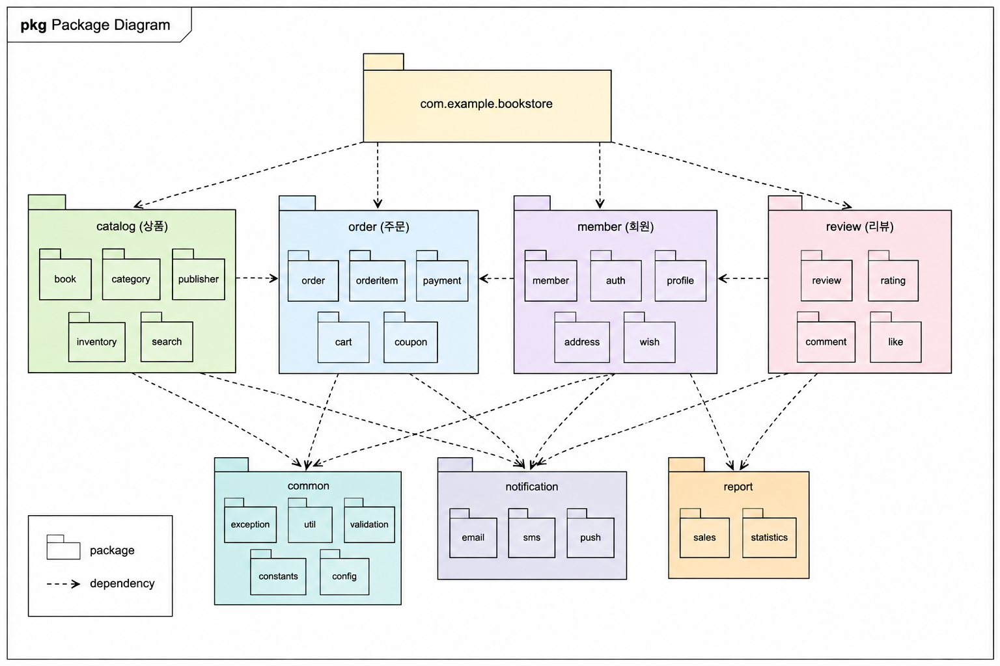
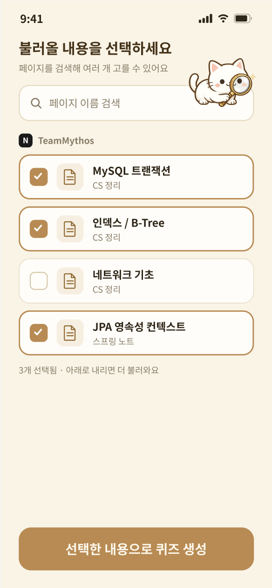
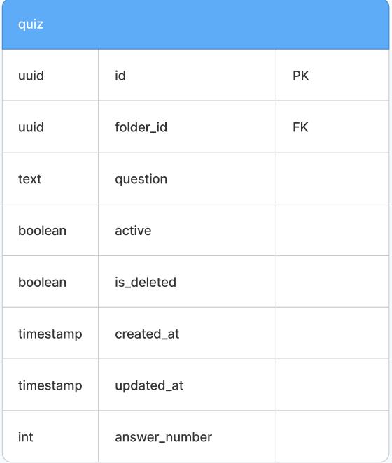

# 패키지 다이어그램

> 클래스 간 응집력이 높은 것들을 하나의 패키지로 묶어 표현한 것 
> 전체 시스템을 상위 수준에서 조망할 수 있어 소프트웨어를 직관적으로 이해하기 쉬움

{ width=600, height=800 }

---

## 패키지 다이어그램 생성 절차

| 단계 | 내용 | 설명 |
|---|---|---|
| (1) | 패키지 다이어그램 작성 대상물 선정 | 어떤 클래스 집합을 대상으로 할지 결정 |
| (2) | 관련성 높은 것들을 그룹핑해서 패키지로 정의 | 응집도는 높게, 결합도는 낮게 |
| (3) | 패키지에 명칭 부여 | 역할이 드러나는 이름 |
| (4) | 패키지 관계 부여 | 연관 · 의존 · 집합 |
| (5) | 패키지 다이어그램 완성 | 다이어그램 프레임 사용 |

### 그룹핑 기준

- 일반화 관계, 집합 관계를 형성하는 모든 클래스는 하나의 패키지로 묶음
- 클래스가 가진 변수나 함수의 유사성을 고려해 패키지화 여부를 결정
- 같이 변경되는 것은 같은 패키지로, 따로 변경되는 것은 다른 패키지로

---

## 계층화된 아키텍처 생성

> 아키텍처 : 컴포넌트와 컴포넌트 간의 관계를 체계화해 표현한 것

### 3계층 아키텍처

| 계층 | 역할 | 대표 산출물 |
|---|---|---|
| Human Computer Interaction | 사용자 인터페이스 담당 | 화면, UI 클래스 |
 | Problem Domain | 업무 로직을 담는 도메인 클래스 | 분석 단계 클래스 다이어그램에서 도출 |
| Data Management | DB 테이블에 대응하는 데이터 클래스 | 테이블, 영속성 처리 클래스 |

{ width=600, height=800 }

{ width=600, height=800 }

---

## 🔑 최종 정리 

> **한 줄 요약:** 패키지 다이어그램은 응집력 높은 클래스를 묶어 시스템을 상위 수준에서 보게 하는 도구이며,   3계층 아키텍처로 컴포넌트 간의 관계를 체계화해 표현한다