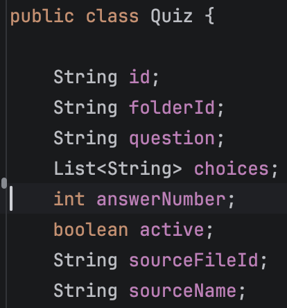
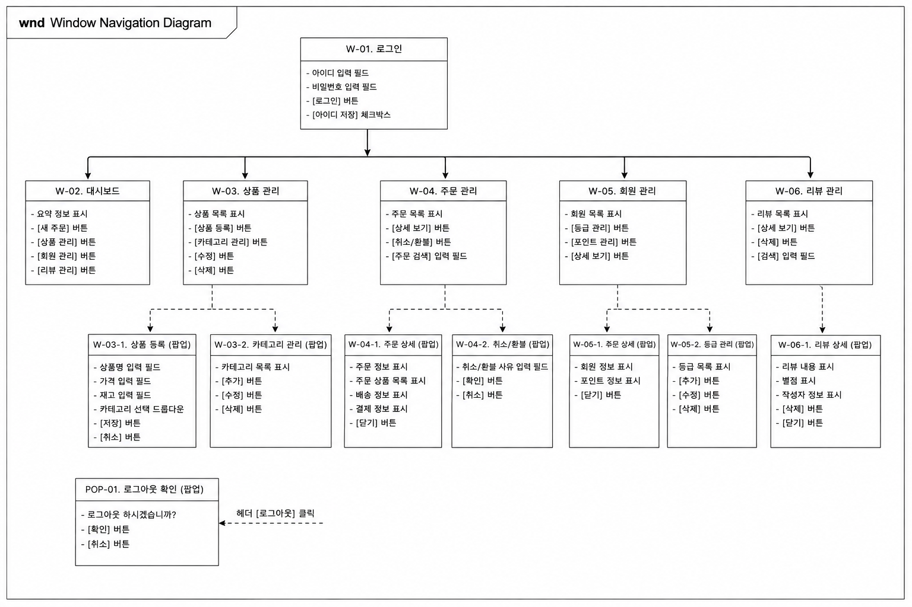
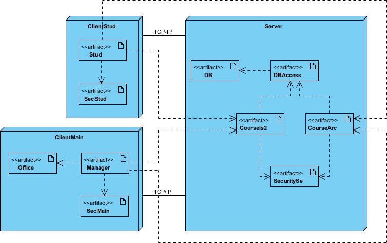

# 자료 구조 설계

> 3계층 아키텍처에서 하위 계층(DM)을 설계하는 데 필요 
> DB 테이블 설계

## 클래스 → DB 매핑

| 클래스 요소 | 매핑 대상 |
|---|---|
| 클래스 | 테이블 |
| 멤버 변수 | 테이블 칼럼 |

매핑 이후 **정규화**, **인덱싱** 과정을 수행

{ width=250, height=350 }
{ width=250, height=350 }

---

# 사용자 인터페이스 설계

## 인터페이스 설계 절차

| 단계 | 내용 | 설명 |
|---|---| --- |
| (1) | 사용 시나리오 개발 | 유스 케이스 다이어그램 시나리오와 유사 형태로 표현 |
| (2) | 인터페이스 구조 설계 | 윈도우 내비게이션 다이어그램 작성 |
| (3) | 인터페이스 표준 템플릿 개발 | 화면 레이어웃 설계 |
| (4) | 인터페이스 프로토타입 개발 | 인터페이스 프로토타입 개발|
| (5) | 인터페이스 평가 | 프로토파입 평가 |

{ width=600, height=800 }

---

# 물리 구조 설계

> 컴포넌트를 구현할 기술을 정하고, 컴포넌트를 운영 환경의 하드웨어 플랫폼에 어떻게 배치할지 설계

## 배치 다이어그램 작성

> 어떤 패키지를 클라이언트에 배치하고 어떤 패키지를 서버에 배치할지 정의

{ width=600, height=800 }

### 고려하는 아키텍처 환경

| 아키텍처 | 특징 |
|---|---|
| 서버 기반 | 처리를 서버가 담당 |
| 클라이언트 기반 | 처리를 클라이언트가 담당 |
| 클라이언트-서버 기반 | 처리를 양쪽이 나누어 담당 |
| 피어투피어 | 각 노드가 대등하게 서로 요청·응답 |
| 독립 운영 | 단독 환경에서 운영 |

### 모델 선택 시 고려 요소

- 개발 비용
- 개발 용이성
- 보안 통제
- 확장성
- 비기능적 요구사항 

## 기술 환경 명세

> 하드웨어 및 소프트웨어에 대한 세부 사항 명세 
> 이후 구현으로 이어짐

---

## 🔑 최종 정리 

하위 계층인 **DM**은 **자료 구조 설계** 

상위 계층인 **HCI**는 **사용자 인터페이스 설계** 

이후 **물리 구조 설계** 
패키지를 클라이언트와 서버 중 어디에 둘지 배치 다이어그램으로 정하고, 서버 기반 등의 아키텍처 중 적절한 모델을 선택

마지막으로 **기술 환경 명세**로 하드웨어와 소프트웨어 세부 사항을 확정하면 설계가 끝나고 구현으로 넘어감

> **한 줄 요약:** 계층별로 DM은 DB 테이블로, HCI는 화면으로 채운 뒤, 패키지를 어디에 배치할지 정하고 기술 환경을 명세하면 설계가 끝나고 구현이 시작