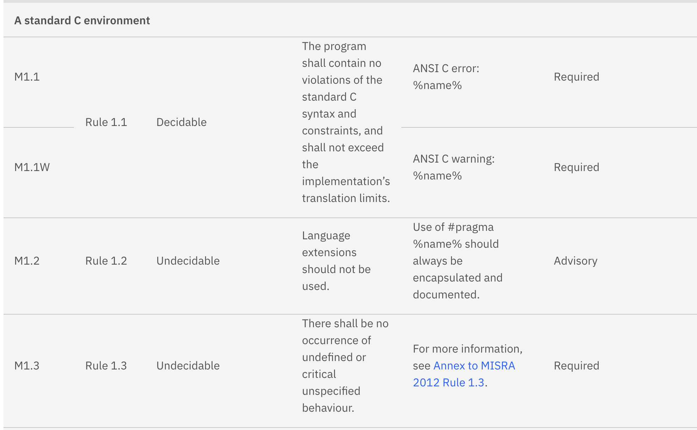
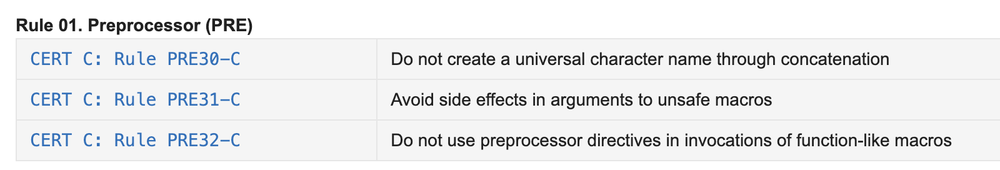

# 코딩 가이드라인

> 코딩 가이드라인을 통해 재사용 가능한 코드를 만들어내 **유용성**과 **적용성**을 높인다.

## MISRA-C 코딩 표준

> 자동차 탑재 소프트웨어의 **신뢰성**과 **호환성**을 높이겠다는 의도로 개발한 C 코딩 표준

### MISRA-C: 2012

- **143개 규칙(Rules)** 과 **16개 디렉티브(Directives)** 로 구성
  - 디렉티브: 정적 분석 도구로 자동 검증하기 어려운, 개발 프로세스 차원의 가이드라인
  - 143개 규칙은 **22개 영역**으로 구분
- 규칙 분류가 **Mandatory / Required / Advisory** 3단계로 세분화

{ width=600, height=800 }

## 시큐어 코딩

> 구현 단계에서 해킹 공격을 유발할 수 있는 **보안 취약점을 제거**하는 프로그래밍 기법

### CERT C 코딩 표준

- **규칙(Rules)** 과 **권고(Recommendations)** 로 구성
- 각 규칙에 **심각성**, **발생 가능성**, **교정 비용** 수준을 나타내는 숫자를 할당

{ width=600, height=800 }

## 🔑 최종 정리

> 한 줄 요약: 코딩 가이드라인은 규칙과 도구로 결함을 막는 장치이며, MISRA-C는 안전성을, CERT C는 보안성을 각각의 축으로 삼는다