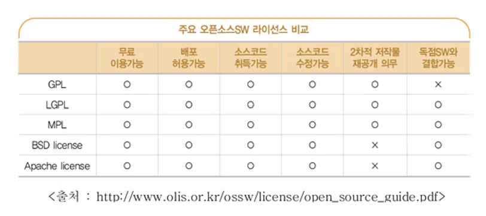

# 오픈 소스 기반 개발

- 개발의 **신속성**과 **효율성**을 목적으로 오픈 소스 기반 개발이 활발
- 기능 단위로 시스템을 분할해, 오픈 소스를 이용한 조립이 이루어짐

## 오픈 소스 기반 개발 프로세스

1. 시스템 기능에 오픈 소스가 적합한지 판단
2. 오픈 소스 통합 및 테스트 수행

## 오픈 소스 활용 시 주의 사항

| 주의 사항 | 내용 |
| --- | --- |
| 라이선스 권한 검토 | 사용·수정·재배포 조건을 확인해야 한다 |
| 오픈 소스 검증 체계 구축 | 품질, 보안 취약점, 유지보수 상태를 검증할 절차가 필요하다 |
| 오픈 소스 변경 사항 기록 | 어떤 버전을 어떻게 수정해 썼는지 추적할 수 있어야 한다 |

{ width=600, height=800 }

## 오픈 소스 활용 환경

### 오픈 소스 검색 및 분석 도구

- Solr, ElasticSearch, Lucene 등이 있다
- 크롤링, 인덱싱, 순위 기반 결과, 메트릭, 코드 취약성 분석 등의 기능을 제공한다

### 오픈 소스 개발 지원 도구

> 코드 통합, 문서화 등 다양한 업무에 사용

| 도구 | 분류 | 설명 |
| --- | --- | --- |
| Git | 버전 관리 | 분산 버전 제어 시스템 |
| Eclipse IDE | 개발 환경 | Java 중심의 통합 개발 환경 |
| BootStrap | 라이브러리 | 프론트엔드 구성 요소 제공 |

### 오픈 소스 기반 개발의 베스트 프랙티스

| 항목 | 내용 |
| --- | --- |
| 팀 의사소통 증대 | 공개된 저장소와 이슈를 중심으로 소통 |
| 사용자 피드백 | 사용자의 반응을 개발에 빠르게 반영 |
| 신속한 배포 | 작게 자주 배포 |
| 투명성 | 코드와 의사결정 과정을 공개 |

## 🔑 최종 정리

> 한 줄 요약: 오픈 소스 기반 개발은 라이선스·검증·변경 이력이라는 관리 책임을 가져야 하며 신속하고 효율적인 개발을 가능하게 한다