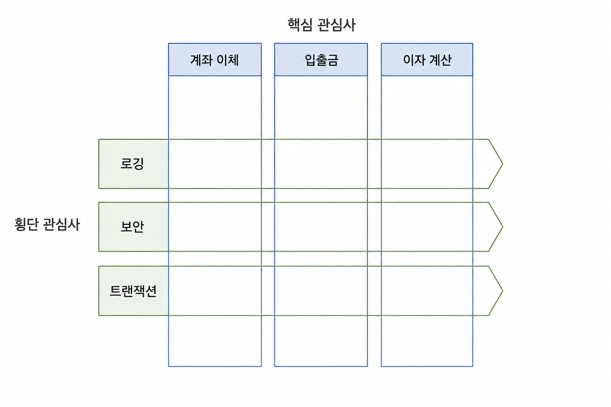

# 관점지향 프로그래밍 (AOP, Aspect-Oriented Programming)

## 객체지향 프로그래밍의 한계

- OOP를 적용해도 **분리해낼 수 없는 관심사**가 존재
- 같은 코드가 여러 클래스·메서드에 **중복**되어 나타남
- 핵심 코드와 횡단 관심 코드가 뒤섞여 **가독성**과 **유지보수성**이 떨어짐

---

##  횡단 관심사 

> 쉽게 분리된 모듈로 작성하기 힘든 요구사항
> 핵심 기능이 아니면서 여러 기능에 공통적으로 요구되는 부분

{ width=600, height=800 }


| 구분 | 설명 | 예 |
|---|---|---|
| 핵심 관심사 | 시스템의 본질적 업무 기능 | 주문 처리, 계좌 이체, 상품 조회 |
| 횡단 관심사  | 여러 모듈에 공통으로 흩어져 나타나는 부가 기능 | 로깅, 보안/인증, 예외 처리, 트랜잭션 |

---

## AOP 개념

> 횡단 관심사를 **별도 모듈로 프로그래밍**한 뒤, 핵심 관심사에 **직조(weaving)** 하여 실행하는 기법
>  횡단 관심사를 중복해서 작성할 필요가 없어진다

### 핵심 용어

| 용어 | 의미 |
|---|---|
| 조인 포인트 | 횡단 관심사 기능이 삽입되어 실행될 수 있는 **위치**. 메서드 호출, 예외 발생 등 |
| 포인트 컷 | 여러 조인 포인트 중 **어디에 적용할지 선택하는 표현식** |
| 어드바이스 | 실제로 수행되는 **횡단 관심사 코드**와 그 실행 시점 |
| 위빙 | 포인트컷이 지정한 조인 포인트에 어드바이스를 **삽입하는 과정** |
| 애스팩트 | 포인트 컷과 어드바이스를 묶은 **AOP의 기본 모듈 단위** |

---

##  Aspect 예시

```java
public aspect LoggingAspect {

    // 포인트 컷 : service 패키지의 모든 메서드 실행 지점
    pointcut serviceMethods() : execution(* com.example.service..*(..));

    // 어드바이스
    before() : serviceMethods() {
        System.out.println("[START] " + thisJoinPoint.getSignature().getName());
    }

}
```

## 위빙

> 위버(Weaver): 핵심 관심사 코드와 애스팩트를 결합해 최종 실행 코드를 만들어 주는 도구


| 구분 | OOP | AOP |
|---|---|---|
| 빌드 과정 | 소스 → 컴파일러 → 실행 코드 | 소스 + 애스팩트 → **위버** → 컴파일러 → 실행 코드 |


### 위빙 시점에 따른 분류

| 위빙 시점 | 설명 |
|---|---|---|
| 컴파일 타임 위빙 | 컴파일 시 바이트코드에 삽입 | 
| 로드 타임 위빙  | 클래스 로더가 클래스를 읽을 때 삽입 | 
| 런타임 위빙 | 실행 중 프록시 객체를 만들어 위임 | 


---

## AOP 지원 개발 도구

| 도구 | 특징 |
|---|---|
| AspectJ | 가장 대표적인 AOP 언어/컴파일러 조인 포인트 범위가 가장 넓음 |
| Spring AOP | 프록시 기반 런타임 위빙. 메서드 실행 조인 포인트만 지원 |

---

## Spring AOP

> Spring은 **프록시 기반 런타임 위빙**을 사용 

>  빈을 감싸는 프록시 객체를 만들고, 메서드 호출을 가로채 어드바이스를 실행한 뒤 실제 객체로 위임

```java
// 1) AOP 활성화
@Configuration
@EnableAspectJAutoProxy
public class AppConfig {}

// 2) 트랜잭션 횡단 관심사 예시 — 애너테이션 한 줄로 적용
@Service
public class OrderService {

    @Transactional               // 트랜잭션 시작/커밋/롤백 코드가 사라짐
    public void placeOrder(Order order) {
        orderRepository.save(order);
        stockService.decrease(order.getItemId(), order.getCount());
    }
}
```


<details><summary>Spring AOP가 AspectJ보다 제한적인 점은?</summary>

Spring AOP는 프록시를 통해 동작하므로 조인 포인트가 스프링 빈의 메서드 실행으로 한정 <br>
 필드 접근, 생성자 호출, private 메서드에는 적용할 수 없고, <br> 
 같은 객체 내부에서 자기 메서드를 직접 호출하면 프록시를 거치지 않아 어드바이스가 동작하지 않는다 
</details>

---

## 🔑 최종 정리

> 한 줄 요약: AOP는 클래스로 나눌 수 없는 횡단 관심사를 애스팩트로 분리하여, 핵심 로직의 순수성과 부가 기능의 재사용성을 동시에 얻는 기법