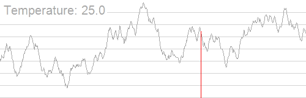

# 탐색기반 소프트웨어 공학

> 메타 휴리스틱을 기반으로 방대한 탐색 공간으로부터 최적의 솔루션을 찾는 방법

> 모든 경우를 다 검색하려고 하면 너무 많은 시간과 비용이 요구됨

메타 휴리스틱이란?

휴리스틱은 최적해를 보장하지는 못하지만 경험적으로 쓸 만한 해를 빠르게 찾는 방법   
메타 휴리스틱은 특정 문제에 종속되지 않고, 어떤 문제에도 적용할 수 있도록 일반화한 상위 수준의 탐색 전략

## 탐색기반 소프트웨어 공학의 의미

> 유전자 알고리즘, 시뮬레이티드 어닐링, 타부 검색과 같은 메타 휴리스틱 검색 기술을 이용해 문제 해결

- 소프트웨어 공학의 문제는 대부분 **최적화 문제**로 연결된다
- 선형 프로그래밍이나 동적 프로그래밍 같은 기술은 대규모 소프트웨어 공학 문제를 해결하는 데 실용적이지 않다
- 너무 커서 전부 탐색할 수 없는 공간으로부터 **최적에 가깝거나 충분히 좋은 솔루션**을 찾는 것이 목적

### 대표적인 메타 휴리스틱 기법

| 기법 | 아이디어 | 특징 |
|---|---|---|
| 랜덤 검색 | 해를 무작위로 뽑아 평가 | 가장 단순, baseline으로 사용 |
| 힐 클라이밍 | 현재 해의 이웃 중 더 나은 쪽으로만 이동 | 빠르지만 지역 최적해에 갇히기 쉬움 |
| 시뮬레이티드 어닐링 | 초기에는 나쁜 해로의 이동도 확률적으로 허용, 점차 확률을 낮춤 | 지역 최적해 탈출 가능 |
| 유전자 알고리즘 | 여러 해를 집단으로 두고 선택·교차·돌연변이로 세대 진화 | 넓은 공간을 병렬로 탐색 |
| 타부 검색 | 최근 방문한 해를 금지 목록에 넣어 재방문 차단 | 같은 곳을 맴도는 현상 방지 |

{ width=600, height=800 }

힐 클라이밍은 무엇인가?

산을 오를 때 항상 더 높은 쪽으로만 발을 내딛는 방식   
현재 해의 이웃 해들을 평가해 지금보다 나은 것이 있으면 그쪽으로 이동하고, 더 나은 이웃이 없으면 멈춘다  
구현이 쉽고 빠르지만, 주변보다만 높으면 멈추기 때문에 진짜 정상이 아닌 봉우리, 즉 지역 최적해에 갇히기 쉽다

시뮬레이티드 어닐링과 유전자 알고리즘, 타부 검색이란?

시뮬레이티드 어닐링은 초기에는 더 나쁜 해로 이동하는 것도 확률적으로 허용해 넓게 탐색하다가, 점점 그 확률을 줄여 좋은 해 근처에 정착  

유전자 알고리즘은 하나의 해가 아니라 해의 집단을 유지   
적합도가 높은 해를 선택해 교차시키고 일부를 돌연변이시켜 다음 세대를 만듦   
여러 지점을 동시에 탐색하므로 지역 최적해에 덜 취약

타부 검색은 최근에 방문한 해나 이동을 타부 리스트에 넣어 일정 기간 재방문을 금지  
 같은 자리를 왔다 갔다 하는 순환을 막고 새로운 영역으로 밀어내는 것이 목적

### 솔루션의 품질 측정

> 적합도 함수, 비용 함수, 목적 함수를 사용해 잠재적 솔루션의 품질을 측정

| 함수 | 의미 | 방향 |
|---|---|---|
| 적합도 함수 | 해가 얼마나 좋은지를 수치로 표현 | 최대화 |
| 비용 함수 | 해가 치르는 대가(오차, 시간, 자원 등)를 수치로 표현 | 최소화 |
| 목적 함수 | 문제가 달성하려는 목표를 수식으로 정의 | 문제에 따라 최대·최소 |

### 탐색 과정

1. 랜덤하게 선택된 초기 상태에서 시작
2. 이웃하는 솔루션을 선택
3. 솔루션의 적합도를 평가
4. 현재보다 좋은 적합도라면, 현재 상태를 이웃 상태로 옮김
5. 이 과정을 반복
6. 지역 최댓값이나 전역 최댓값을 탐색

---

## 탐색기반 소프트웨어 공학의 적용

> 소프트웨어 개발 전 과정에 적용 가능하며 **테스트**에 가장 활발하게 적용

| 단계 | 적용 내용 |
|---|---|
| 계획 | 비용, 업무 규모, 스케줄, 작업 할당 등에 대한 예측 활동 |
| 분석 | 비용과 사용자 만족도, 리스크 등을 고려해 좋은 대안 탐색 |
| 설계 | 적절한 아키텍처 및 설계 패턴을 찾기 위해 최적화 알고리즘 적용 |
| 구현 | 구현된 프로그램을 실행 속도와 자원 사용 측면에서 최적화 |
| 테스트 | 테스트 케이스 자동 생성, 테스트 케이스 최소화, 테스트 케이스 우선순위 결정 |
| 유지보수 | 버그 탐색 및 자동 수정 |

---

## 🔑 최종 정리 

> 한 줄 요약: 탐색기반 소프트웨어 공학은 소프트웨어 공학 문제를 적합도 함수로 표현한 뒤, 메타 휴리스틱 탐색으로 방대한 공간에서 충분히 좋은 해를 찾아내는 접근법이다