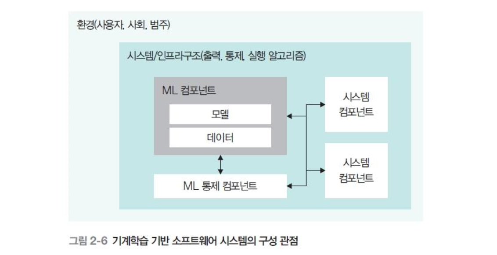

# 02 인공지능 소프트웨어 품질

### 기계학습 기반 시스템

> 사람이 직접 코딩하는 대신, 데이터를 학습해 스스로 규칙을 찾아내는
> 컴포넌트를 하나 이상 포함한 시스템

전통적인 소프트웨어와의 차이점

> 전통 소프트웨어는 같은 입력에 항상 같은 출력이 나오지만 인공지능 소프트웨어는 같은 입력이어도 출력이 달라진다.

> 왜 이런 결과가 나왔는지 파악하기 어렵고, 데이터에 편향이 있으면 출력도 편향된다.

## 인공지능 소프트웨어의 품질 특성

| 요소             | 설명                                                              |
| ---------------- | ----------------------------------------------------------------- |
| 투명성           | 입력에 대한 결과 값 재현                                          |
| 책임             | 출력이 왜 그렇게 나왔는지 해석하고 설명할 수 있는가               |
| 다양성·공정성    | 특정 요소에 편중하여 출력 제공하면 안됨                           |
| 보안과 안전성    | 데이터가 좋은 품질·무결성을 가져야함, 노이즈나 악의적 데이터 대처 |
| 견고성과 신뢰성  | 유해하거나 예상 못한 입력에 대해서도 믿을 만한 결과 제공          |
| 법적·윤리적 측면 | 인간에게 적용되는 법적·윤리적 문제 보장                           |

생성형 AI는 확률 기반인데 결과를 재현할 수 있나? 투명성을 적용할 수 있나?

생성형 AI는 엄밀한 재현성은 약하지만, 시드·온도로 통제 가능하다.
투명성은 재현성만이 아니라 더 넓은 설명 가능성까지 포함하므로,
학습 데이터·모델 한계·의사결정 과정 등을 공개해 투명성을 적용할 수 있다.

시드·온도는 무엇인가?

- 온도: 생성 결과의 무작위성 정도를 조절하는 값. 0에 가까울수록 답이 일관되고, 값이 높을수록 다양하고 창의적인 답을 생성.
- 시드: 무작위성의 시작점을 고정하는 값. 온도가 0이 아니어서 무작위성이 있더라도 시드를 고정하면 그 무작위 결과가 매번 똑같이 재현됨.

보안성과 안전성은 전통 SW에도 요구되는 품질 아닌가? 무엇이 다른가?

전통 소프트웨어는 주로 코드가 공격 대상이었다. 하지만 AI 소프트웨어는 모델과 데이터 자체가 공격 대상이 될 수 있다. 학습 데이터에 악의적 데이터를 넣어 모델을 망가뜨리는 등의 공격이 가능하다.

AI 모델과 학습 데이터에 대한 실제 공격 사례가 있는가?

- 데이터 오염 : 학습 데이터에 악의적 데이터를 섞어 모델을 망가뜨림. 예) 스팸 필터 무력화
- 적대적 공격 : 입력에 미세한 노이즈를 추가해 AI가 완전히 다른 객체로 인식하게 함

## 시스템 관점별 품질 요소

### 기계학습 기반 소프트웨어 시스템 구성

| 관점        | 다루는 것                                    |
| ----------- | -------------------------------------------- |
| 데이터 관점 | 모델에 들어가는 데이터의 품질                |
| 모델 관점   | 데이터로 훈련된 학습 모델 자체               |
| 인프라 관점 | 학습·실행에 쓰는 하드웨어·라이브러리         |
| 시스템 관점 | 모델과 데이터를 연결하고 전체 형상 구성·제어 |
| 환경 관점   | 시스템과 사용자/사회가 어떻게 상호작용하는가 |

### 모델 관점 품질 요소

| 요소        | 설명                                               |
| ----------- | -------------------------------------------------- |
| 모델 타당성 | 모델 유형이 적합한가                               |
| 적합성      | 기능이 데이터를 기반으로 정확하게 수행되는가       |
| 견고성      | 누락 혹은 오류 있는 데이터를 잘 처리할 수 있는가   |
| 안정성      | 서로 다른 데이터에 대해 반복적인 결과를 생성하는가 |
| 공정성      | 출력이 공정한 결정을 제시하는가                    |
| 해석능력    | 훈련된 모델의 내용을 사람이 해석할 수 있는가       |

### 데이터 관점 품질 요소

| 요소   | 설명                                                       |
| ------ | ---------------------------------------------------------- |
| 대표성 | 데이터가 모집단을 대표하는가                               |
| 정확성 | 데이터가 오류 없이 개발되었는가                            |
| 완전성 | 누락된 데이터가 없는가                                     |
| 유통성 | 데이터가 최신 내용을 포함하는가 (시의성)                   |
| 독립성 | 훈련 데이터와 테스트 데이터가 상호 독립적인가              |
| 일관성 | 서로 다른 데이터셋에 대해 형식·표본 추출이 일관성이 있는가 |

### 인프라 관점의 품질 요소

| 요소          | 설명                                       |
| ------------- | ------------------------------------------ |
| 인프라 적합성 | 이 모델 돌리기에 우리 하드웨어가 적합한가  |
| 훈련 효율성   | 모델을 학습시키는데 드는 자원이 합리적인가 |
| 실행 효율성   | 모델을 서비스에서 실행시킬 때 효율적인가   |

### 시스템 관점의 품질 요소

**출력 제어** — 모델의 출력을 감시

| 요소        | 설명                                          |
| ----------- | --------------------------------------------- |
| 효과성      | 모델이 이상한 출력을 내는 걸 잘 감지하는가    |
| 제어 효율성 | 출력을 모니터링하는 데 쓰는 자원이 효율적인가 |

**범주 제어** — 적용 상황·문맥의 변화를 감시

| 요소        | 설명                                               |
| ----------- | -------------------------------------------------- |
| 효과성      | 상황·문맥이 바뀐 걸 잘 탐지하는가                  |
| 제어 효율성 | 문맥 변화를 모니터링하는 데 쓰는 자원이 효율적인가 |

문맥 변화를 어떻게 모니터링하는가?

학습 때와 지금을 지표로 계속 비교한다.

- 데이터 드리프트: 입력 데이터의 분포가 변하는지
- 개념(컨셉) 드리프트: 입력 분포는 비슷하지만 입력과 정답의 관계 자체가 변하는지
- 감지되면 모델을 새 데이터로 재학습시켜 대응

### 환경 관점의 품질 요소

| 요소      | 설명                                              |
| --------- | ------------------------------------------------- |
| 환경 영향 | 이 모델 학습이 지구 환경에 영향을 얼마나 미치는가 |
| 사회 영향 | 이 AI가 사회에 어떤 영향을 끼치는가               |
| 범위 준수 | AI가 원래 의도한 용도 안에서만 쓰이는가           |

원래 의도한 용도 밖에서 쓰이는 AI에는 무엇이 있을까?

딥페이크(얼굴 합성 기술의 악용), 범용 모델의 전문 영역 오용(번역 모델을 법률 자문에),
보조 AI의 과신(진단 보조 AI를 최종 결정에 그대로 사용)

---

## 🔑 최종 정리

인공지능 소프트웨어는 규칙을 사람이 짜는 게 아니라 **데이터로 학습**한다.

- 같은 입력에도 출력이 달라지고, 동작 근거가 모델 속에 숨어있고,
  데이터에 편향이 있으면 출력도 편향된다.
- 그래서 전통 품질 요소만으론 부족하고 **새 품질 특성**이 필요하다
  → 투명성·책임·공정성·보안·법적윤리

> 한 줄 요약: **데이터로 학습한다는 특성**이 새로운 AI 품질을 만들었다.
