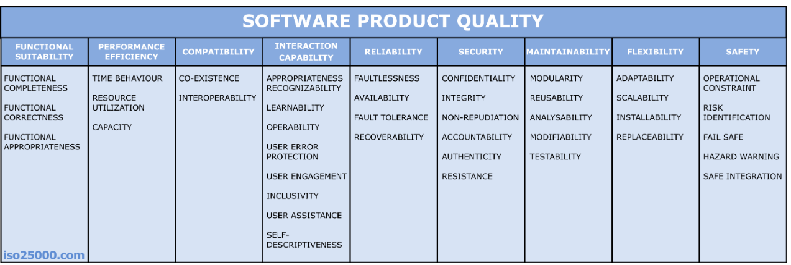

# 소프트웨어 품질 모델 및 표준

> 품질 요소들을 체계적으로 정리·평가하기 위한 공식 분류 체계

> 발전 흐름: McCall(1977) → FURPS → ISO 9126 → ISO 25010

## McCall의 FCM 모델

- 가장 초기(1977)의 품질 모델. 3계층 구조.
- Factor(품질 요소) → Criteria(평가 기준) → Metric(측정 지표) 로 나눠
  추상적 품질을 점차 측정 가능한 수치로 내려가게 함.
- 품질을 3가지 관점으로 분류:
  - 제품 운영 (Operation): 정확성·신뢰성·효율성·무결성·사용성
  - 제품 수정 (Revision): 유지보수성·유연성·시험성
  - 제품 전이 (Transition): 이식성·재사용성·상호운용성

## HP의 FURPS 모델

- 품질 요소를 5가지 머리글자로 분류:
  - Functionality (기능성)
  - Usability (사용성)
  - Reliability (신뢰성)
  - Performance (성능)
  - Supportability (지원성: 유지보수·확장 등)
- 뒤에 '+'를 붙인 FURPS+ 는 설계·구현·인터페이스 제약 등을 추가.

## ISO/IEC 9126 품질 모델

- 1991년 제정된 국제 표준. ISO 25010의 전신.
- 6개 특성: 기능성·신뢰성·사용성·효율성·유지보수성·이식성
- 한계: 보안·호환성을 독립 특성으로 다루지 못함 → 25010으로 개정됨.

## ISO/IEC 25010 품질 모델

- 2011년 제정. 현재의 사실상 국제 표준 (SQuaRE 시리즈).
- 9126을 확장해 보안성과 호환성을 독립 특성으로 승격한 게 핵심 변화.
- 제품 품질 모델: 8개 특성 (각각 세부특성으로 다시 분할)

| 특성        | 의미                                              |
| ----------- | ------------------------------------------------- |
| 기능 적합성 | 명시·암묵적 요구를 충족하는 기능을 제공하는가     |
| 성능 효율성 | 주어진 자원으로 효율적으로 동작하는가 (시간·자원) |
| 호환성      | 다른 시스템과 정보 교환·공존이 가능한가           |
| 사용성      | 사용자가 쉽고 효과적으로 사용할 수 있는가         |
| 신뢰성      | 정해진 조건에서 안정적으로 기능을 수행하는가      |
| 보안성      | 데이터를 보호하고 인가된 접근만 허용하는가        |
| 유지보수성  | 수정·수리·업데이트가 쉬운가                       |
| 이식성      | 다른 환경으로 쉽게 옮길 수 있는가                 |

- 이 외에 사용 품질(Quality in Use) 모델 5개 특성을 별도로 둠

품질 모델이 하나로 통일되지 않고 여러 개 존재하는 이유는?

- 만든 주체·목적이 다름: McCall은 학술적 분류, FURPS는 HP 실무용, ISO는 국제 표준화
- 시대를 반영함: 9126(1991)엔 덜 중요했던 보안·호환성이 인터넷·클라우드 시대에 critical해져 25010이 추가
- 도메인마다 중요한 품질이 다름: 게임=성능·사용성, 금융=보안·무결성, 의료·항공=안전성
- 품질 자체가 다면적: 하나의 모델로 다 담으면 너무 추상적이거나 복잡해짐
- 결론: 좋은 품질이 보는 사람·시대·분야마다 달라 단일 정답 모델이 없다. 그래서 25010이 사실상 표준 역할을 하되 상황에 맞게 골라 쓴다.

실무에서는 어떤 표준을 가장 많이 따르는가?

품질 모델 중에선 ISO/IEC 25010이 사실상 국제 표준(de facto). 다만 표준 준수는 층위가 여러 개다.

호환성과 전환성의 차이는?

- 호환성: 다른 시스템과 같은 환경에서 정보를 교환하고 공존하며 함께 동작하는가
- 전환성: 소프트웨어를 다른 환경으로 옮기거나 재사용하기 쉬운가

# 소프트웨어 품질 관리

## 정량적 품질 개선

- 품질을 느낌이 아니라 숫자로 측정해 개선하는 접근
- 결함 밀도, 코드 커버리지, 순환 복잡도 등을 측정 → 목표치와 비교 → 개선
- 측정해야 관리할 수 있다는 발상

블랙박스 방식과 화이트박스 방식은 무엇인가?

- 블랙박스: 내부 구조를 안 보고 입력과 출력만으로 검증. 사용자 관점, 요구사항 충족 확인. 예) 기능 테스트, 인수 테스트.
- 화이트박스: 내부 코드를 보고 모든 경로·분기를 따라가며 검증. 개발자 관점. 예) 단위 테스트, 커버리지 분석

## 정보 저장소 (Repository)

- 프로젝트에서 나온 데이터를 모아두는 저장소
- 과거 데이터를 축적해 추정·예측·의사결정의 근거로 사용

## 🔑 최종 정리 — 한 장의 흐름

품질 모델은 흩어진 품질 요소들을 체계적으로 정리·평가하기 위한 공식 분류 체계다.

> 발전: McCall → FURPS → ISO 9126(6특성) → ISO 25010(8특성, 표준)

품질 관리는 이 기준들을 실제로 다루는 활동이다.

> 정량적(숫자로 측정) → 정보 저장소(데이터 축적) → 예측적(미리 예방)

> 한 줄 요약: 품질 모델은 무엇을 품질로 볼지의 기준  
> 품질 관리는 그 기준을 따라 측정 → 축적 → 예측으로 사후 수습이 아닌 사전 예방으로 가는 것.
