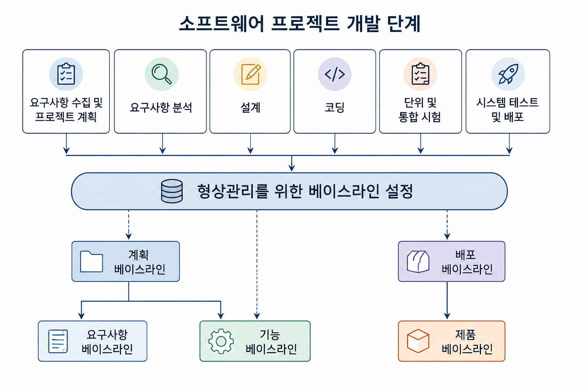
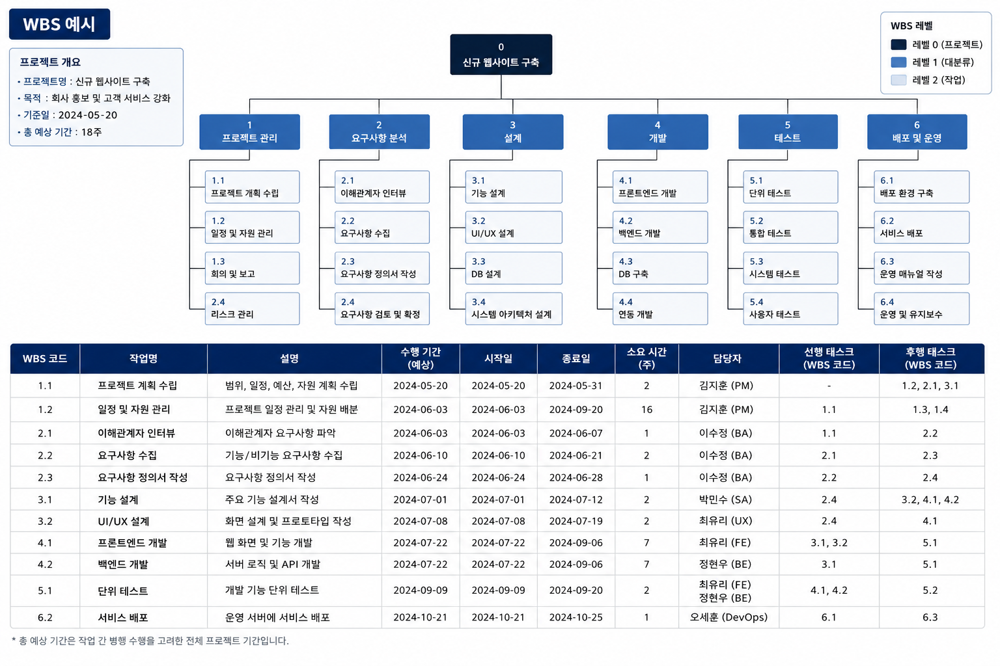
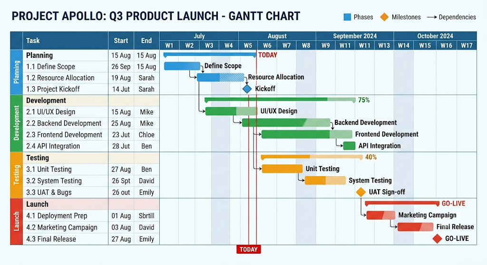
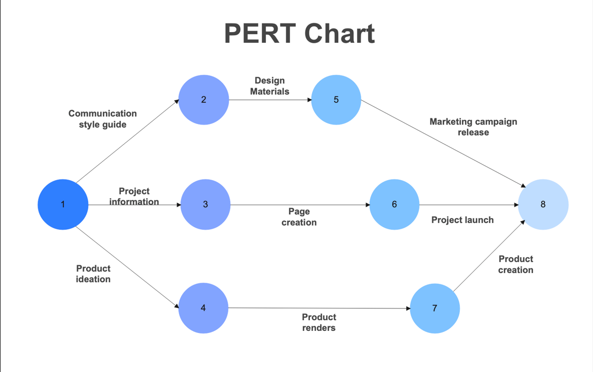
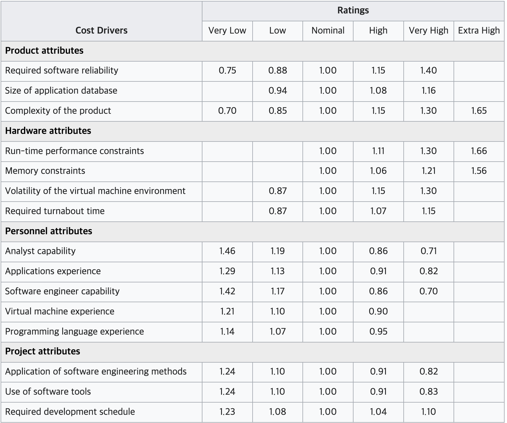

# 프로젝트 관리 기법

> 정확하게 비용을 산정하기는 불가능하지만, 예측된 값을 기반으로 프로젝트를 관리함

## 일정 관리 기법

> 어떤 프로세스 모델을 선정했는지, 어떤 베이스라인을 정의할지에 따라 정해짐

### 베이스라인 관리

| 베이스라인 | 정의 시점 |
|------------|-----------|
| 요구사항 베이스라인 | 요구사항을 수집하고 계획을 수립한 후 정의 |
| 기능 베이스라인 | 요구사항 분석 후 설정 |
| 제품 베이스라인 | 개발 완료 후 정의 |

### WBS

> 프로젝트 전체 목표를 중간의 세부 목표들로 쪼개어 트리 형태로 나타낸 목록

> 프로젝트에서 수행해야 하는 모든 종류의 작업 식별이 목적

- 독립적으로 이루어질 수 있을 때까지 태스크를 분할
- 태스크 수행 시간, 선행·후행 태스크, 담당자 정보 포함
- 전체 소요 시간 파악 가능
- 문서화, 프로젝트 리뷰 같은 작업도 태스크로 식별해야 함

### 간트 차트

> 스케줄링, 예산 산정, 자원 계획 수립을 위한 일정 표현 기법

> 바 차트 형태로 소요 시간 표현

### 퍼트 차트

> 태스크 간 의존 관계를 표현하는 차트

- 원으로 태스크, 화살표로 의존성 표현
- 핵심 수행 경로인 임계 경로를 식별하고 관리 가능
- 태스크 수행 일수의 합이 가장 많은 경로가 임계 경로

## 비용 관리 기법

### COCOMO / COCOMO Ⅱ

> 유사 소프트웨어를 비교 분석해 KDSI를 산출하고, 복잡도에 근거해 세 가지 모드 중 하나 선택

> KDSI : 소스 코드를 1000줄 단위로 센 것, 코드가 만 줄이면 10 KDSI

| 개발 모드 | 성격 | 소요 인력 | 소요 일수(월) |
|---|---|---|---|
| Organic | 작고 단순 | PM = 2.4(KDSI)^1.05 | TDEV = 2.5(PMDEV)^0.38 |
| Semidetached | 중간 규모 | PM = 3.0(KDSI)^1.12 | TDEV = 2.5(PMDEV)^0.35 |
| Embedded | 크고 복잡, 엄격한 제약 | PM = 3.6(KDSI)^1.20 | TDEV = 2.5(PMDEV)^0.32 |

> 복잡한 모드일수록 같은 코드 양이어도 더 많은 노력이 필요

- PM : Person-Month, 한 사람이 한 달 일하는 양을 단위로 한 총 노력
  - ex) PM=24면 한 사람이 24개월, 두 사람이 12개월
- PMDEV = PM × 노력 승수
- TDEV : 프로젝트 종료까지 소요되는 개월 수

**노력 승수 표**

> 15가지 인자 값을 선정하고 모두 곱하면 최종 노력 승수 값

> COCOMO Ⅱ는 코드 라인 수만 이용하지 않고, 기능의 양과 복잡도를 기준으로 규모 산정

KDSI를 어떻게 예측하는가?

개발 전에는 코드 라인 수를 알 수 없으므로 추정이 필요

- 유사 시스템 비교 : 과거 비슷한 프로젝트의 실제 코드 규모를 참고해 추정
- 기능 점수 환산 : 기능 점수를 먼저 산정한 뒤, 개발 언어별 환산 계수를 곱해 코드 라인 수로 변환

### 전문가 판단 (Wide Band Delphi)

> 다수의 전문가가 모여 요구사항을 기준으로 크기 예상

- 전문가 그룹 선정, WBD 진행 방식 설명
- 전문가에게 필요한 정보 제공
- 의견을 정량화해 규모 산정
- 결과를 취합해 통합 버전 작성 후 피드백
- 의견 차이를 확인하고 재논의

### 파킨슨 법칙

> 어떤 방법으로 비용을 산정해도 **조직의 인력**에 개발 일정이 맞춰져 진행됨

> 인력을 외부에서 고용하거나 하청을 통해 개발하면 부적합

### 기능 점수 산정법

> 시스템이 제공하는 기능의 필요 정도와 복잡도를 기준으로 비용 산정

> 최근 표준 비용 산정 방법으로 활용

기능 점수 산정법이란 무엇인가?

사용자 관점에서 시스템이 제공하는 기능의 수와 복잡도로 규모를 재는 방법. 
코드 라인 수와 달리 개발 언어나 구현 방식과 무관해서, 개발 전 요구사항 단계에서도 산정 가능

- 외부 입력 : 시스템으로 들어오는 데이터 처리
- 외부 출력 : 시스템이 내보내는 결과
- 외부 조회 : 입력에 대한 즉시 응답 조회
- 내부 논리 파일 : 시스템 내부에서 관리하는 데이터 집합
- 외부 연계 파일 : 외부 시스템과 주고받는 데이터 집합

각 항목을 단순·보통·복잡 등 복잡도에 따라 가중치를 부여해 합산

## 위험 관리

> 프로젝트 기간에 발생할 수 있는 리스크를 예측하고, 예방·완화하기 위한 계획 수립

- ex) 소마 프로젝트 중 취업으로 팀원 이탈, 잦은 요구사항 변경

## 🔑 최종 정리 

일정 관리는 베이스라인으로 기준점을 잡고, WBS로 작업을 잘게 쪼갠 뒤, 간트 차트로 일정을 그리고 퍼트 차트로 태스크 간 의존 관계와 임계 경로를 관리 
비용 관리는 COCOMO는 KDSI라는 코드 규모를 입력으로 노력과 기간을 계산하고, 그 KDSI 자체는 유사 사례·전문가 판단·기능 점수로 예측
위험 관리는 팀원 이탈이나 요구사항 변경 같은 리스크를 미리 예측해 대비 
