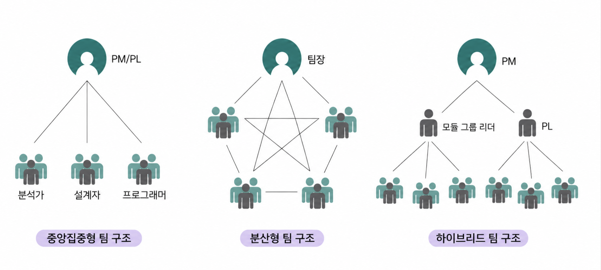

# 프로젝트 조직

> 프로젝트에 적합한 인력을 확보하는 게 프로젝트 성공에 가장 중요

### 프로젝트 구성원 역할

| 역할 | 담당 업무 |
|------|-----------|
| PM | 프로젝트 전반의 관리와 중요 이슈 해결 |
| TL | 팀의 기술적 문제를 주도적으로 해결 |
| CM | 베이스라인 산출물 관리와 변경 요청 처리 |
| QE | 리뷰와 테스트로 오류 확인 및 결함 검출 |

 CM은 정확히 무슨일을 할까? 실제 저 역할이 기업에 있을까?

## 프로젝트 팀 구조

{ width=600 }

### 중앙집중형

> 작업이 단순하거나 충분히 이해된 경우에 적합한 팀 구성 방식

- 프로젝트 리더가 기술과 시스템 설계에 대한 상세 정보를 잘 알고 있어야 함
- 문제를 신속하게 해결
- 의사소통 패턴 단순
- 짧은 기간에 신속하게 처리하는 데 적합
- 리더에 부하가 걸릴 수 있음

### 분산형

> 팀 구성원 합의에 의해 주요 의사결정이 이루어지는 민주주의적 팀 구성

- 모든 팀원이 작업 수행 결과를 공유
- 팀원 사기 진작, 팀원 교체 줄일 수 있음
- 문제가 복잡한 경우에 적합
- 장기간 프로젝트에 적용
- 대규모 구성원을 포함한 프로젝트에는 적합하지 않을 수 있음

### 하이브리드

> 중앙집중형과 분산형 팀 구조를 통합한 계층형 팀 구조

- 두 팀 구조의 장점 모두 도입
- 프로젝트 관리자는 각 팀 리더와 중앙집중형 구조
- 팀 내부 운영은 분산형 구조

> 빠른 개발은 중앙집중형, 의사소통이 필요한 경우는 분산형

| 팀 구조 | 적합한 경우 | 핵심 특징 |
|---------|-------------|-----------|
| 중앙집중형 | 단순·이해된 작업, 짧은 기간 | 리더 주도, 빠른 해결, 리더 부하 |
| 분산형 | 복잡한 문제, 장기 프로젝트 | 합의 기반, 사기 진작, 대규모엔 부적합 |
| 하이브리드 | 둘의 장점이 모두 필요한 경우 | 팀 간 중앙집중형 + 팀 내부 분산형 |

## 전사적 운영 조직

> 팀 구성을 매트릭스 구조로 운영, 업무를 수행한 후 다른 팀에 참여

### 품질 관리 팀

> 전사 차원의 품질 관리 가이드라인 마련

- 품질 관리 도구 관리 및 팀원 교육
- 리뷰, 인스펙션, 테스트 같은 활동 지원

### PMO

> 전사 차원에서 프로젝트 생성, 모니터링, 리스크 해결 지원 등의 업무 수행

- 비즈니스 우선순위에 따라 어떤 프로젝트를 우선 진행해야 하는지 분석·결정 
- 엔지니어 역량을 어디에 집중·분배해야 할 지 결정

전사적 운영 조직이 정확히 무엇인가?

개별 프로젝트 팀 바깥에서, 회사 전체차원으로 여러 프로젝트를  지원하는 상설 조직  
전사적 운영 조직은 회사에 계속 남아 모든 프로젝트를 떠받침  

매트릭스 구조 : 한 사람이 자기 소속 기능 조직과 참여 중인 프로젝트에 동시에 속하는 구조  
그래서 어떤 업무를 마치면 다른 팀으로 옮겨 참여 가능

## 🔑 최종 정리 

> 한 줄 요약: 프로젝트 조직은 적합한 인력에 역할을 부여하고, 작업 성격에 맞는 팀 구조로 묶은 뒤, 전사 조직으로 지원