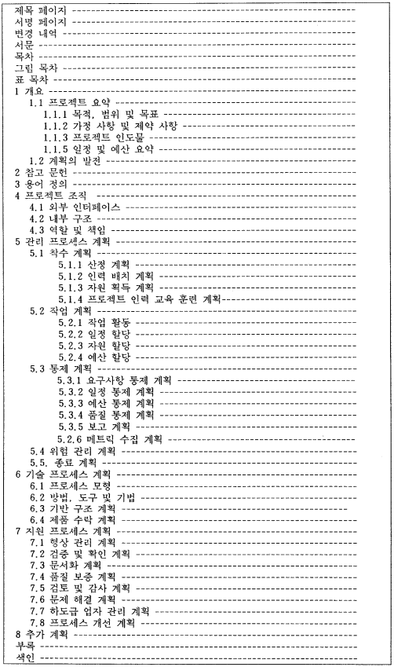

# 프로젝트 관리 계획서

## 유의 사항

- 문서의 목적 : 문서가 어떤 목적으로 작성되고 어떤 내용을 포함하는지 설명
- 관련 문서 : 공식적인 이전 베이스라인 산출물, 관련 표준
- 개발 계획 : WBS, Gantt Chart
- 기술 관리 계획 : 버전 관리, 형상 관리 
- 품질 관리 계획 : 품질 목표, 검토 방법 및 주기, 품질 관리 적용 기법

### 예시 이미지

{ width=600, height=800 }

## 🔑 최종 정리 

> 한 줄 요약: 프로젝트 관리 계획서는 개발·기술·품질 계획을 하나로 묶은 기준 문서