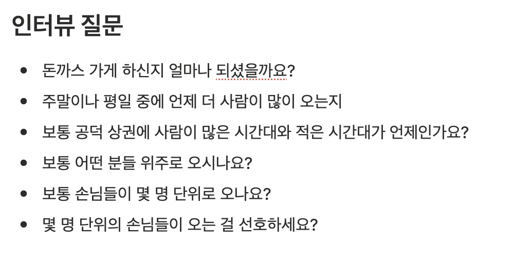
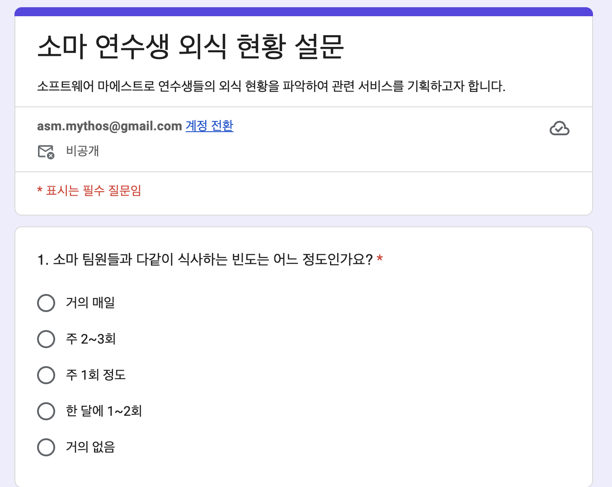

# 요구사항 수집 기법

> 누구를 대상으로 어떤 정보를 수집하고 어떻게 정리할지 고민해야 한다

## 대면 수집 기법

> 직접 만나 요구사항을 수집하므로 자세한 설명을 들을 수 있고 요구사항 수집의 정확도와 완전성 높음

> 시간과 비용이 많이 소모되는 단점  

### 인터뷰

- 인터뷰 준비 
  - 대상자를 선정한다
  - 대상자에 대한 기초 지식을 학습하고 질문을 작성해 정리한다
- 인터뷰 실시
- 인터뷰 정리
  - 수집한 정보를 정리한다
  - 인터뷰 전체 과정을 회고한다

{ width=600, height=800 }

### JAD 세션

> PM, 사용자, 개발자가 모여 상호 토론을 통해 요구사항을 도출하는 방법

- 모든 사람이 의견 제시 
- 요구사항 증가 및 변경이 50% 이상 줄어드는 효과

{ width=600, height=800 }

## 비대면 수집 기법

> 다양한 정보를 적은 비용으로 수집할 수 있다는 장점

> 대체로 현행 정보만 수집하게 되고 깊이 있는 정보를 알기 어렵다는 단점

### 문서 분석

> 소프트웨어를 사용할 업무에서 현재 사용하고 있는 문서 분석

> 새로운 요구사항의 확보보다는 현재 상태의 현황 정보를 수집 

### 설문지

> 다수 사용자에게 배포하여 필요한 정보를 수집

- 설문 대상과 설문 문항을 잘 작성하는 게 중요 : 배포하면 다시 수정할 수 없기 때문

{ width=600, height=800 }

### 관찰

> 사용자가 수행하는 것을 살펴보는 활동

> 매일 수행하는 일이라서 중요하다고 생각하지 않는 업무 처리 과정을 찾아내는 것이 목적

### SNS

> 시공간 제약 없이 다수 사용자에게서 요구사항 수집 가능

> 비정형 데이터 형식으로 데이터가 수집되므로 정보를 잘 추출하는 과정 필요

## 🔑 최종 정리 

> 한 줄 요약: 요구사항 수집은 깊이가 필요하면 대면(인터뷰·JAD), 다양한 의견과 비용 효율이 필요하면 비대면(문서·설문·관찰·SNS)을 택한다.