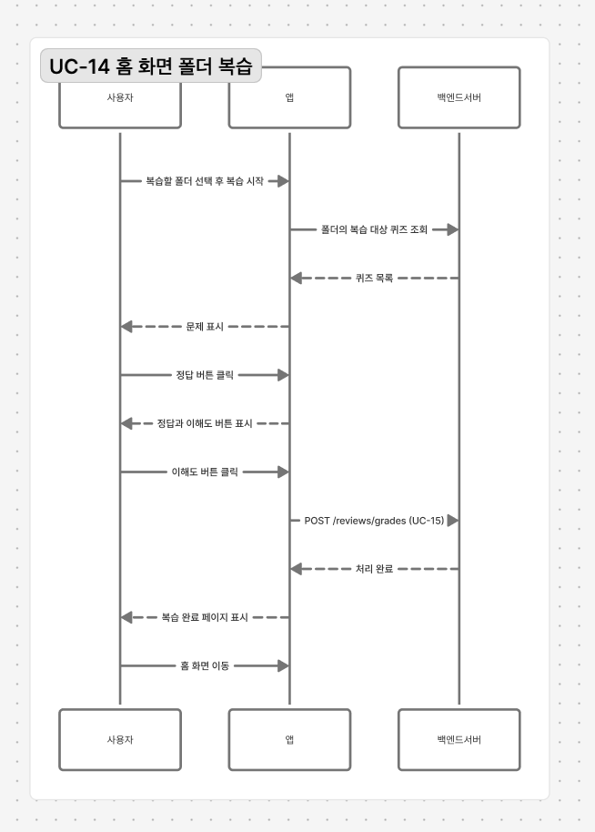

# 행위 모델링

> 시스템의 내적인 동작을 표현하는 다이어그램

> 객체 간 어떤 상호작용이 발생하는지 나타낸다

> 클래스가 아닌 인스턴스 기준으로 작성

## 순차 다이어그램 구성 요소 

> 메시지 패싱에 대한 행위를 시간 축을 중심으로 표현

- 참여 객체 : 클래스 다이어그램에 존재하는 클래스 객체가 존재
- 시간 축 : 위에서 아래 방향으로 메시지 전달 순서 표현
- 실행 사건 : 메시지를 처리하기 위한 실행 동작 발생
- 메시지 전달 : 객체 간 상호작용,즉 객체 간 함수 호출
- 제어 로직 : 선택, 반복, 병렬 처리 등을 결합형 심볼로 표현
  - 결합형 심볼 : Alternative - 선택
  - 결합형 심볼 : Loop - 반복
  - 결합형 심볼 : Parallel - 병렬

## 순차 다이어그램 작성

> 유스 케이스별로 작성 

{ width=600, height=800 }

## 상태기계 다이어그램 작성

> 시스템 상태들의 변화로 모델링

> 어느 한 상태에 있다가 이벤트가 발생하면 다른 상태로 전이 

> 객체의 상태 변화를 표현